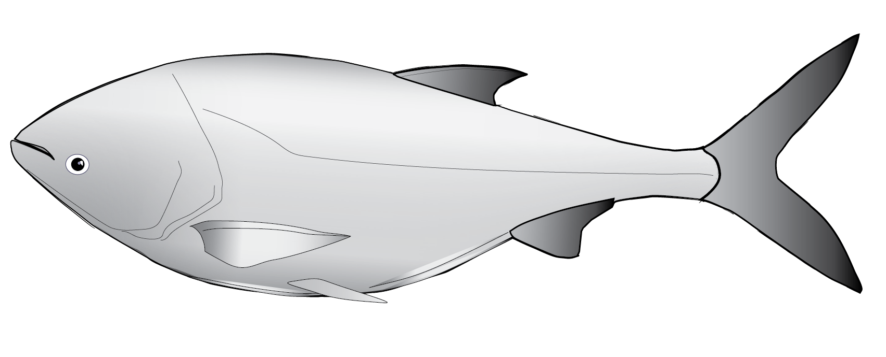
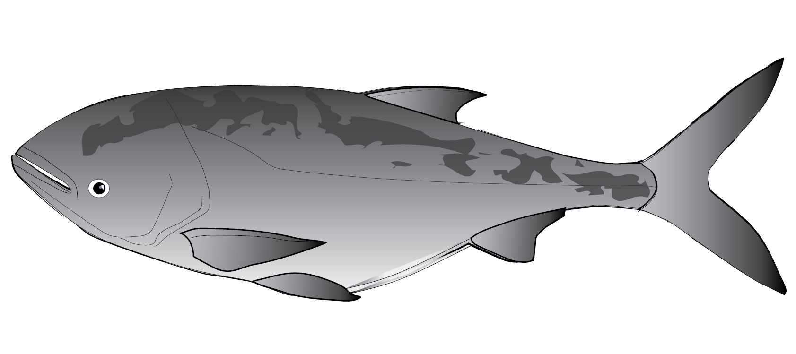

<!-- This adds my headshot, floating to the left of the text and with 20 pixels of padding around it.  -->

 I recently started a position as Assistant Professor of Biology at Hope College in Holland, MI (USA). Before my position at Hope College, I was a postdoctoral researcher at Iowa State University investigating the recruitment dynamics of species in the genus *Hypophthalmichthys* sp. known as bigheaded carps invading the Mississippi River Basin. I also delved into the temporal dynamics of gene introgression between the two bigheaded carps using low coverage whole genome sequencing (lc-WGS) data.

 In 2021, I graduated from the interdisciplinary [Program in Ecology](http://www.uwyo.edu/pie/) as part of [Dr. Catherine Wagner's Lab](https://cewagnerlab.com/) at University of Wyoming, Laramie WY. For my PhD, I studied drivers of cichlid fish diversity in the shallow littoral of Lake Tanganyika, East Africa, combining population genomic technologies, biodiversity surveys, behavioral assays, and natural history observations. Such an integrative approach provided a unique glimpse into both the origination and persistence processes underlying endemic ichthyofaunal diversity accumulation.

 I have always loved learning languages, culture, and history, and more recently contributing to [iNaturalist](https://www.inaturalist.org/users/318056). I value most being outside or underwater, as well as quality time with friends and family.
 

{width=125px}*Silver Carp*
 
{width=125px}*Bighead Carp*

 
 

