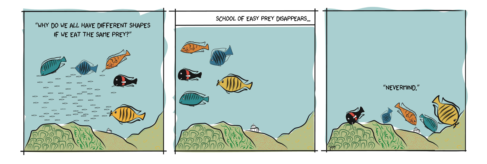

--- 
title: "Research"
output: 
  html_document:
    css: ['CSSBackgrounds.css', 'CSSFonts.css']
    includes:
      after_body: footer.html
---

#### Biodiversity Research

My research interests involve conducting field and laboratory-based experiments that serve as “proof of concept” for available theory in evolutionary ecology. For instance, I have experimentally tested whether predators can help maintain a color-polymorphism in Nicaraguan cichlid fishes for my master’s thesis as part of a project led by [Dr. Julian Torres-Dowdall](TorresDowdall_etal_2017.pdf). More recently, I conducted behavioral assays testing for intraspecific aggression biases that could help mediate coexistence of sympatric and congeneric fishes in Lake Tanganyika (in revision). 

For my [PhD dissertation research](https://www.proquest.com/docview/2572576794?pq-origsite=gscholar&fromopenview=true) as part of [Dr. Catherine Wagner's Lab](https://cewagnerlab.com/), I conducted replicated fish surveys along the bathymetric gradient in Lake Tanganyika, Tanzania, to examine how the ecological context, particularly energy availability, shapes morphological divergence and species richness at a community level using phylogenetic methods (in prep.). For his master's degree at University of Wyoming [Alexander Lewanski](Lewanski_etal_2022.pdf), closely examined the spatial distribution patterns of two sympatric and congeneric algal-grazing cichlids in this same survey data set to evaluate how differences in abundances across sites where these two species co-occur may explain their spatially variable hybridization. 

An [idea](Golcher-Benavides_Wagner_2018.pdf) I am particularly drawn to is the context-dependent nature of specialization, and how food resource availability may shape the evolution of specialized foraging strategies. An important implication of this idea is that the level of dietary partitioning may then vary if food abundance varies across seasons. Together with [Dr. Cody K. Porter](https://ckporter.weebly.com/) and [Dr. Craig W. Benkman](https://www.uwyo.edu/benkman/), we uncovered that across vertebrates, dietary partitioning was greatest when food abundance was low ([Porter et al. 2022](porter_et_al_2022.pdf)). 

 An illustration of *Liem*’*s* *paradox* in cichlid species from Lake Tanganyika.

#### Fisheries Conservation Research
Recent human-mediated fish species invasions have accelerated extinction of numerous freshwater fishes even in some of the world's largest freshwater ecosystems such as the African Great Lakes, the Great Lakes of North America, and the Mississippi River Basin. 

Large invasive carp now contribute disproportionately to fish catches in the Upper Mississippi River and motivate large-scale management actions to prevent further expansion of the carp invasion front into the Great Lakes. Among the invasive carp, Silver carp (also known as "jumping carp") and Bighead Carp successfully reproduce upstream from high-head navigation dams in the Upper Mississippi River, including the Lock and Dam 19, a fish movement barrier in Keokuk, IA. Understanding how environmental factors such as water temperature and river discharge influence reproduction upstream from the Lock and Dam 19, will provide feedback on the effectiveness of population control efforts at an invasion front.   

For this project, I am collaborating with my two postdoctoral research advisors in the Department of Natural Resource Ecology and Management at Iowa State University: [Dr. Michael J. Weber](https://michaeljohnweber.wixsite.com/fisherieslab) and USGS Iowa Cooperative Fish and Wildlife Research Unit leader [Dr. Michael J. Moore](https://moorefishlab.weebly.com/), along with commercial anglers, researchers and conservation practitioners in Iowa DNR, Illinois Natural History Survey, Southern Illinois University - Carbondale to examine the reproductive biology of Silver Carp in the Upper Mississippi River. Our objective is to assess environmental predictors of annual variation in recruitment of Silver Carp with known natal origin using microchemistry and stable isotope techniques. I recently obtained funding to study gene exchange between the two bigheaded carp species invading the Upper Mississippi River. Doing so, I hope to identify how introgression influences the population dynamics in one of the costliest freshwater fish invasions. 

### Publications
My [Google scholar](https://scholar.google.com/citations?user=WAxpZLEAAAAJ&hl=en&oi=ao) contains an up-to-date list of my scientific publications so far. Please contact me if you would like access to a pdf of any of these. *A Nature News and Views write-up of one of my publications written by Dr. Sebastian Kruppert and Dr. Adam Summers can be found [here](https://www.nature.com/articles/d41586-019-02008-6?utm_source=twt_nv&utm_medium=social&utm_campaign=newsandviews).

