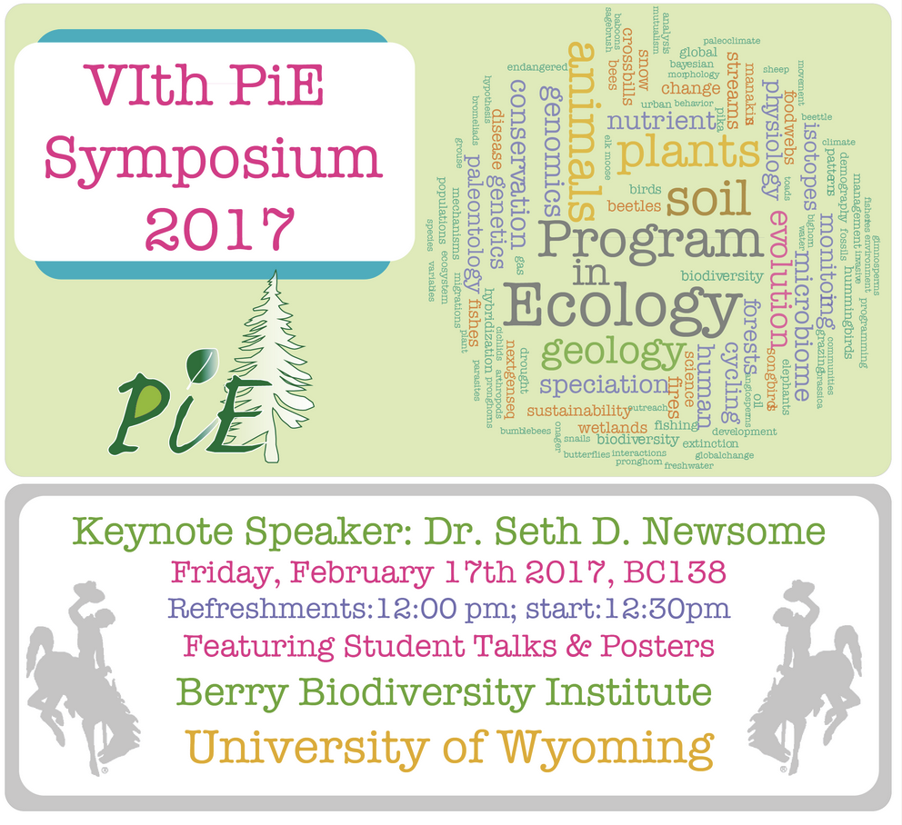
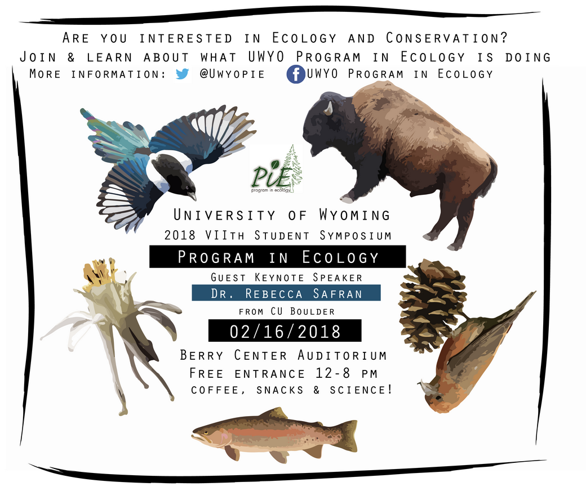
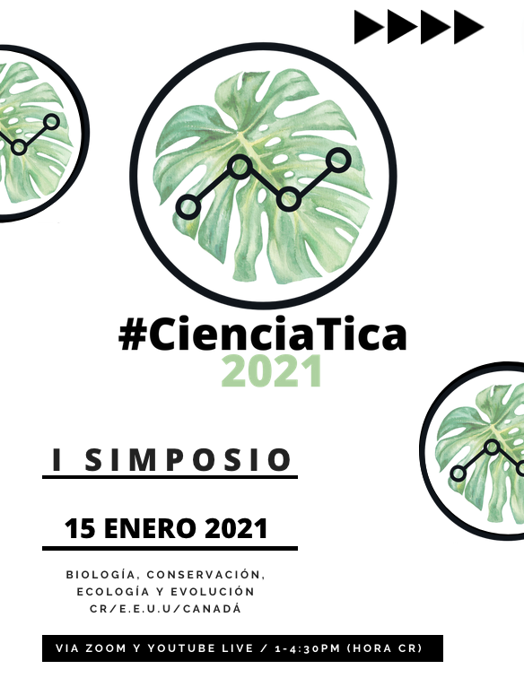
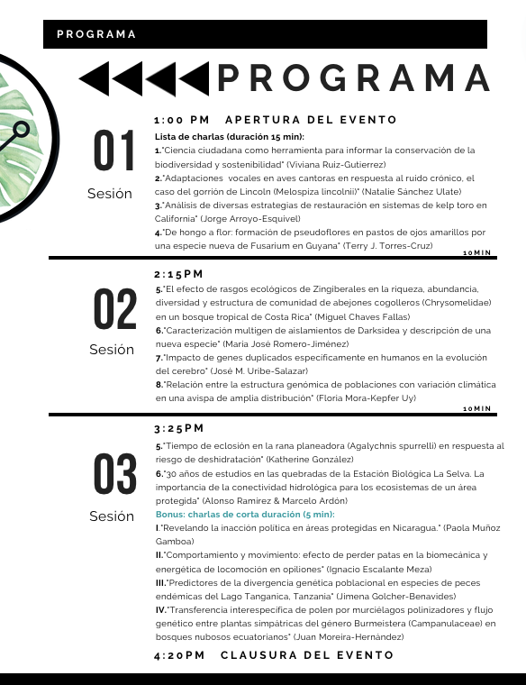
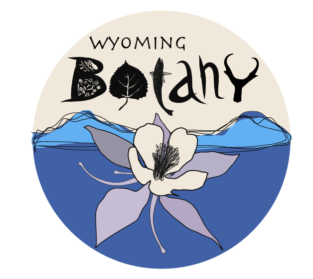
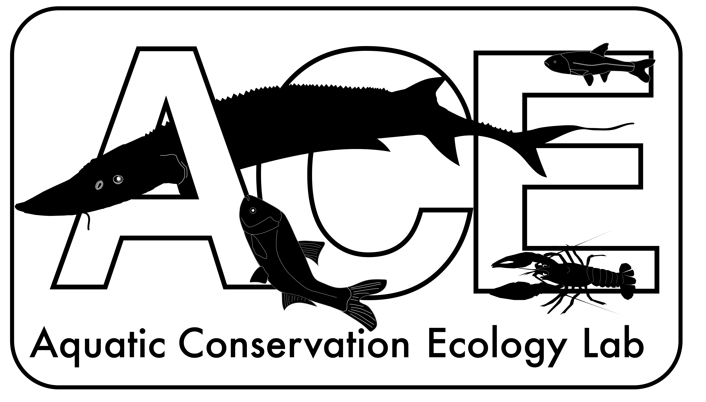
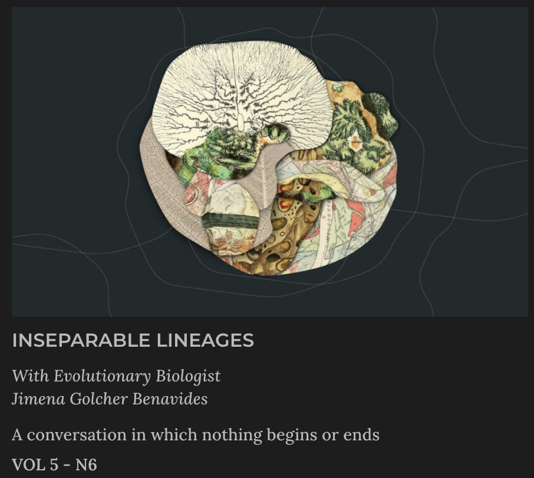
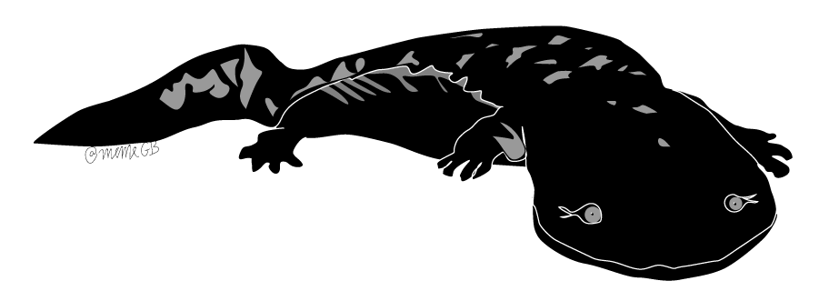

--- 
title: "Courses"
output: 
  html_document:
    css: ['CSSBackgrounds.css', 'CSSFonts.css']
    includes:
      after_body: footer.html
---

### Teaching at Hope College
In the Spring Semester 2025, I am teaching BIOL 106 General Biology II and BIOL 421 Evolutionary Biology lectures . In the Fall Semester 2024, I taught BIOL 395 (lecture and lab) an upper level in Aquatic Ecology.

I have taught Genetics, General Zoology, Introduction to Evolution, and General Biology as instructor of record at Lees McRae College in North Carolina. I have assisted courses in General Biology, Ecology, Evolutionary Biology (University of Wyoming) and Zoology (Universität Konstanz, Germany).

## Teaching Statement

*“Wisdom* *is* *not* *a* *product* *of* *schooling* *but* *of* *the* *lifelong* *attempt* *to* *acquire* *it.”* — Albert Einstein

My goal is to spark curiosity about biology through concrete experiences, real world examples, and through evaluating issues in conservation from different perspectives.

One way I instill curiosity in my students is through active learning activities. For instance, students in ecology practiced biodiversity metrics on their taxonomic group and location of choice using iNaturalist, a popular public science platform and growing online biodiversity database. As [an active user](https://www.inaturalist.org/users/318056) of iNaturalist (over ~3,000 observations so far), I was also able to demonstrate engagement for scientific activities beyond traditional settings.  I keep my self up-to-date in technological advances and constantly seek opportunities to present both inquiry-based content in multiple ways, fostering curiosity and learning. 

The process of learning is inherently multifaceted; thus, I believe that integrating content and assessment tools in various forms can be beneficial for student learning. For instance, I use individual and team-based quizzes, to encourage collaboration and helping of others. Integrating the interests of students is another way to cultivate a learning drive and self-confidence that can promote peer-learning. Class projects in which students take concepts learned in class and apply it to solve a puzzle or societal problem of their choice is a powerful way to transfer knowledge that directly matches societal needs (McInerney et al. 2011, Delić and Bećirović 2016).

One way I have implemented such an experiential learning framework (as described in Walker and Rocconi 2022) is through an environmental DNA (eDNA) lab in a Genetics course [recently published here](https://acaweb.org/friendly.php?s=environmental_dna). In this activity students learned the steps of a scientific project starting with a concrete experience in wildlife conservation involving the detection of a local aquatic species of conservation concern, listening to local conservation practitioners, developing, and implementing a monitoring protocol, reflecting on their understanding of a tool in molecular genetics, and suggesting new ideas for future projects.

In addition to incorporating customized content, instilling curiosity and critical thinking, I also believe in integrating relevant and diverse examples into teaching, so that students can witness more of the diverse and intercultural community currently involved in the process of discovery, science, and technology (Landreman 2013; Tanner 2013). I love discussing scientific ideas, and celebrating diversity through examples of varied scientific careers in my teaching. Just as previous researchers encouraged me to pursue science, I pursue opportunities to inspire and help others to do so. 

### Service
I have served as reviewer for Journal of Evolutionary Biology, Hydrobiologia, Journal of Great Lakes Research, Functional Ecology, and the International Journal of Tropical Biology and Conservation (Rev. Biol. Trop.). I have also participated in and helped organized career panels, University of Wyoming's PiE Student Symposium, and #CienciaTica Symposium together with Dr. [Juan Moreira Hernandez](https://scholar.google.com/citations?user=xCGg3AgAAAAJ&hl=en), as well as co-taught workshops in Tanzania together with fellow CE Wagner Lab Dr. [Jessica Rick](http://jessicarick.com) on:
Intro to R computer programming (Summer 2019)
Statistical Analyses and Advanced R Programming for Fisheries (Summer 2018)

{width=250px}{width=250px}
{width=250px}{width=250px}

*Flyers I've made for events I helped organize*

 
{width=250px}{width=250px}{width=250px}

*Example logos I've made over the years*

### Service Outreach
Along with my research interests, I strive to be an engaging science communicator activities involving both adult and children audiences.

Recently, Alessandra Baltodano from [Wimblu](https://wimblu.com/en/) invited me to be a guest in their magazine's podcast for an episode about "Inseparable lineages" where we discussed the unity of all forms of life ([available here](https://wimblu.com/en/volumen-5/linajes-inseparables/)). 

I enjoy acting as judge for State Science Fairs and I love making short videos that I share through a youtube channel, if interested check this one I made of [Lake Tanganyika](https://www.youtube.com/watch?v=ekSZXCzmmfc). I also post nature photography on my [Instagram](https://www.instagram.com/golcherbenavides/?hl=en) account.

Please contact me if you are interested in a guest lecture or outreach activity on biodiversity, freshwater fish conservation, or to chat about cool fish. 

If you would like classroom material about fish, check [this worksheet](./Fish_Underwater_4thGrade_28jan2021.pdf) I prepared to introduce 4th grade students to fish biology.

{width=250px}

Art by Wimblu Carolina Bello May*

### Citations
Delić, H., and Bećirović, S. (2016). Socratic method as an approach to teaching. European Researcher. Series A, (10), 511-517.  
Landreman, L. M. (Ed.). (2013). The art of effective facilitation: Reflections from social justice educators. Stylus Publishing, LLC..  
McInerney, P., Smyth, J., and Down, B. (2011). ‘Coming to a place near you?’The politics and possibilities of a critical pedagogy of place-based education. Asia-Pacific journal of teacher education, 39(1), 3-16.  
Rauschert, E. S., Yang, S., and Pigg, R. M. (2019). Which of the Following Is True: We Can Write Better Multiple Choice Questions. The Bulletin of the Ecological Society of America, 100(1), e01468.  
Tanner, K. D. (2013). Structure matters: twenty-one teaching strategies to promote student engagement and cultivate classroom equity. CBE—Life Sciences Education, 12(3), 322-331.  
Walker, J. P., and Rocconi, L. M. (2021). Experiential Learning Student Surveys: Indirect Measures of Student Growth. Research & Practice in Assessment, 16(1), 21-35.  
Wiggins, G. P., and McTighe, J. (2011). The understanding by design guide to creating high-quality units. ASCD.  
iNaturalist. Available from https://www.inaturalist.org. Accessed [06/30/2022].  

{width=250px}

An illustration of [*Cryptobranchus* *alleganiensis*](https://en.wikipedia.org/wiki/Hellbender) a vulnerable aquatic species endemic to the eastern and central United States.

